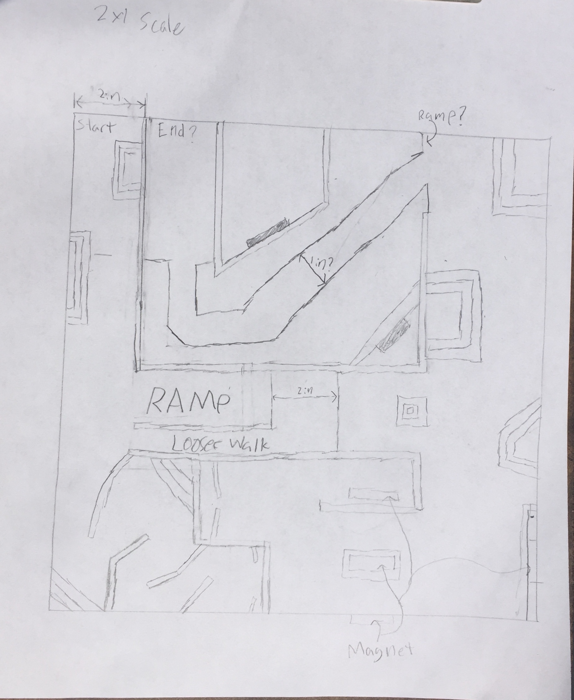

 # Smartphone Controlled Magnetic Tilt Maze


| **Engineer** | **School** | **Area of Interest** | **Grade** |
|:--:|:--:|:--:|:--:|
| Jordan Estes | Pacifica Christian High School | Small Scale Civil Engineering | Incoming Junior

[!]: <>
  
# Final Milestone
My final milestone is finishing the actual project itself. I had finished all of the physical work in stage 2 and mostly worked on coding. With some help from my instructor I wrote a code in Arduino and an app in the MIT app inventor that allowed the gyro sensor from the android phone to connect to the servos that I had put on the maze. This was my first time doing something like this so I'm proud of how well it turned out. Ironically, however, even though the physical parts were done, it was a hardware bug that was plaguing me. I messed around with the code and bug-checked it with my instructor but we couldn't figure out what was wrong. The maze kept sliding over to the right side and then not having the proper alignment when it was reset. Eventually, I figured out that there was so much hot glue in the servo that the gears couldn't get enough friction and kept sliding. I replaced the part and it worked perfectly. I'm very proud of this project even though I think there are a few things that could have done better. For one, I should have had much stricter plans from the start. My stand gave me a lot of trouble because I was slightly off in the measurements. I also wish that I had designed the maze differently, I didn't account for how shaky the maze control would be due to instability in the hand that was controlling it. Overall, however, everything went better than I expected.  

[](https://www.youtube.com/watch?v=sZeFgF37LVI "Jordan Milestone 3")

# Second Milestone
My second milestone was the construction of the actual maze itself. I realized that my previous design was based on having an additional servo motor so I had to redesign half of the blueprint. Despite that, it ended up rather well. I implemented a sort of progression system into the second half which was inspired by the Mario Games. In the earlier Mario titles, progression works by introducing a very simple concept that is unique to that level. The concept is then expanded upon and grown into something unique. I decided to do something similar on a much more micro level with my magnets and tight ropes. I also built the outside stand for the maze inspired by the original video. However, the original didn't have dimensions for this framework so I had to measure the pixel counts to get measurements. Even with this success, I'm still concerned about a few things. I think the tight rope sections might be much too hard, they are for me at least. To compensate I think I'm going to need to make the phone control very fine. I hope it works. 
[](https://www.youtube.com/watch?v=y3VAmNlER5Y&feature=emb_logo "Second Milestone"){:target="_blank" rel="noopener"}

[](https://www.youtube.com/watch?v=2_3fSznL9RU "Jordan Milestone 2")

# First Milestone
  

My first milestone was designing both the electronics and the physical components of my maze. I realized that I wanted the interior of the maze to be more of the focus of the project, compared to the control scheme. Therefore I decided to add various components, such as magnets, that would change how players needed to move. They couldn't just focus on the aspect of moving the phone but also on how the maze was affecting the ball. In the same way, I realized that I wanted to have some interior parts of my maze move. I realized that the mini servos that had already been provided to move the maze itself could be very useful. I figured out the basic coding for the mini servos and linked them up to the ESP 32. Next week I hope to begin to construct the maze itself, considering that I now have some of the cardboard I need. 

[![First Milestone][](https://www.youtube.com/watch?v=WQiFSGz7FkA "Smartphone Controlled Magnetic Tilt Maze Milestone 1"){:target="_blank" rel="noopener"}





```
// very basic sample code to move the servos
#include <ESP32Servo.h> 

Servo myservo;  // create servo object to control a servo
// twelve servo objects can be created on most boards

int pos = 0;    // variable to store the servo position

void setup() {
  myservo.attach(13);  // attaches the servo on pin 13 to the servo object
}

void loop() {
  for (pos = 0; pos <= 180; pos += 1) { // goes from 0 degrees to 180 degrees
    // in steps of 1 degree
    myservo.write(pos);              // tell servo to go to position in variable 'pos'
    delay(15);                       // waits 15ms for the servo to reach the position
  }
  for (pos = 180; pos >= 0; pos -= 1) { // goes from 180 degrees to 0 degrees
    myservo.write(pos);              // tell servo to go to position in variable 'pos'
    delay(15);                       // waits 15ms for the servo to reach the position
  }
}
```

